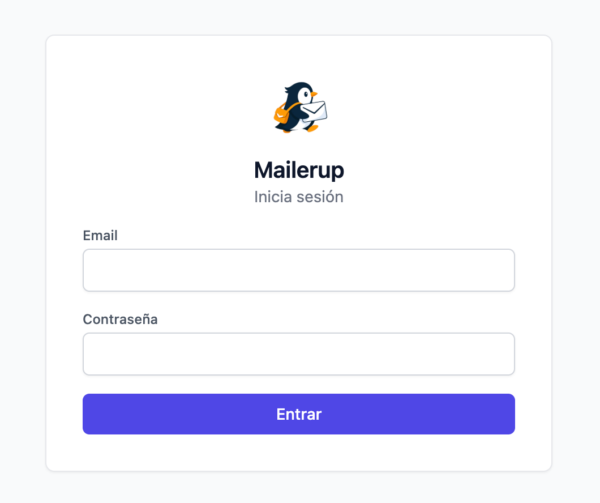
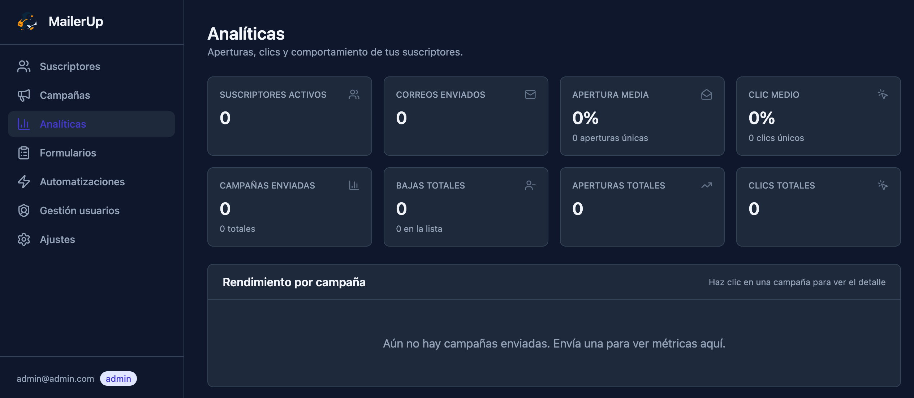
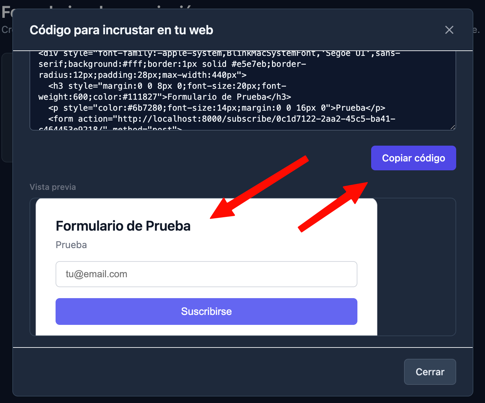
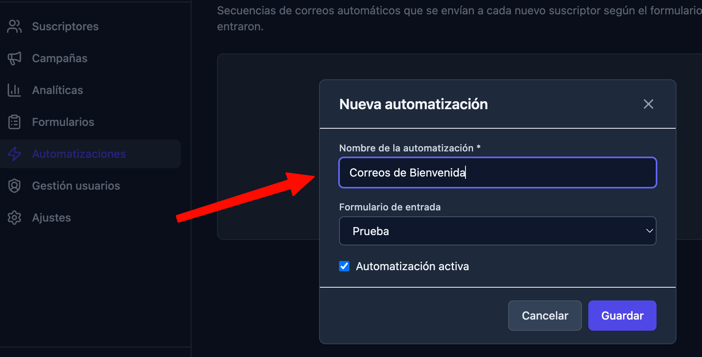
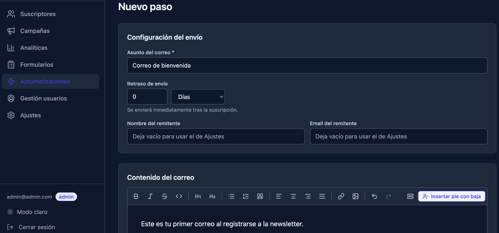
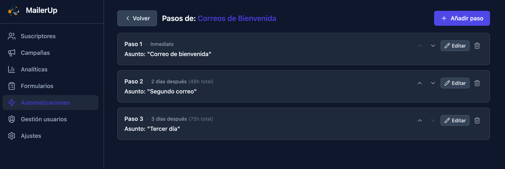

<p align="center">
  
</p>

# MailerUp

**Versión 1.0.2**

Plataforma autoalojada de newsletter al estilo MailerLite/Mailchimp: gestiona suscriptores, crea correos con un editor enriquecido, envíalos al instante o prográmalos, y mide aperturas y clics. Pensada para correr en una VPS modesta (despliegue **nativo**: PostgreSQL + systemd/uvicorn + nginx — ver [`deploy/README.md`](deploy/README.md)) con SMTP de tu hosting o Postfix local (Raiola, Gmail, Outlook, IONOS…), sin depender de servicios externos de pago.

## Capturas de pantalla

### Login
<p align="center">
  
</p>

Pantalla de acceso limpia con el logo de la app. Autenticación mediante JWT almacenado en cookies HttpOnly — sin tokens expuestos en el navegador.

---

### Analíticas (modo oscuro)


Panel de analíticas con KPIs globales: suscriptores activos, correos enviados, tasa media de apertura y de clic. La tabla inferior muestra el rendimiento desglosado por campaña. Soporte completo de **modo oscuro** activable desde el sidebar con un clic.

---

### Formularios — código embed


Desde la sección **Formularios** se genera un snippet HTML listo para pegar en cualquier web. El modal muestra el código y una vista previa en tiempo real del formulario. Al suscribirse, el visitante recibe un email de verificación automático antes de entrar en la lista.

---

### Automatizaciones — crear secuencia


Crea una automatización y vincúlala a un formulario de suscripción. Cada formulario puede tener su propia secuencia de bienvenida independiente.

---

### Automatizaciones — editor de paso


Cada paso de la secuencia se edita con el mismo editor rico (Tiptap) que las campañas: formato completo, alineación, imágenes, enlaces y variables de personalización (`{{first_name}}`, etc.). Se configura el retraso de envío en horas o días desde la suscripción.

---

### Automatizaciones — vista de secuencia


Vista de la secuencia completa con todos los pasos ordenados, el delay de cada uno y botones ↑↓ para reordenarlos. El paso 1 se envía de forma inmediata, el 2 a los 2 días (48h), el 3 a los 3 días (72h), etc.

---

## Stack

- **Backend**: Django 6 + Django REST Framework + PostgreSQL + JWT (cookies HttpOnly)
- **Frontend**: React 19 + Vite + Tailwind CSS + Tiptap (editor WYSIWYG)
- **Envío**: SMTP genérico (~15 presets preconfigurados) o APIs Brevo / SendGrid
- **Programación**: hilo de scheduler in-process (sin Celery worker ni Redis necesarios)
- **Despliegue**: Docker Compose (web + nginx + Postgres)

## Funcionalidades

- Roles **admin** / usuario normal con `Gestión de usuarios` (admin-only)
- Suscriptores con import/export CSV
- Editor WYSIWYG (negrita, cursiva, listas, enlaces, imágenes, toggle de espaciado)
- Inserción de pie de correo + botón "Darse de baja" con un clic
- Programación de envíos a fecha futura
- Pestañas **Borradores · Bandeja de salida · Programados**
- Analíticas de campañas **y de automatizaciones** (aperturas, clics, sin abrir, top enlaces, detalle por destinatario y por paso)
- Endpoints públicos firmados para baja (`/u/`), tracking de campañas (`/o/`, `/c/`) y de automatizaciones (`/oa/`, `/ca/`)
- 20 proveedores de email con presets DNS (SPF/DKIM/DMARC) específicos por proveedor
- Email de prueba con diagnóstico claro (auth fail, host inválido, SPF, etc.)
- Backup de DB descargable (admin-only)

## Despliegue con Docker

Todo corre con **Docker Compose**: tres servicios — `web` (Django + uvicorn ASGI), `nginx` (compila y sirve el frontend + proxy a la API) y `db` (PostgreSQL, datos en el volumen `pgdata` que **persiste entre actualizaciones**). Las migraciones y los estáticos se aplican **solos** al arrancar el contenedor `web`.

### Primera instalación en una VPS

```bash
# 1. Docker + plugin compose
curl -fsSL https://get.docker.com | sh

# 2. Clonar el repo
git clone https://github.com/Maalfer/mailerup.git /opt/mailerup
cd /opt/mailerup

# 3. Crear los dos ficheros de entorno (NO se versionan)
cp backend/.env.example backend/.env   # SECRET_KEY, ALLOWED_HOSTS, PUBLIC_BASE_URL, SMTP…
cp .env.example .env                    # POSTGRES_PASSWORD y DATABASE_URL (misma contraseña)

# 4. Levantar
docker compose up -d --build

# 5. Crear el primer admin
docker compose exec web python manage.py createsuperuser
```

La app queda escuchando en `127.0.0.1:${NGINX_HOST_PORT}` (por defecto **8110**). Pon delante tu **nginx/Cloudflare con TLS** haciendo `proxy_pass` a ese puerto.

## Actualizar

```bash
cd /opt/mailerup
bash update.sh
```

`update.sh` hace, en orden: **backup** de la BD (`pg_dump`) → `git reset --hard origin/<rama>` → `docker compose up -d --build` (las migraciones y el `collectstatic` corren solos en el arranque) → **health check** → limpieza de imágenes. Si no hay commits nuevos y los contenedores ya corren, no hace nada (**apto para cron**).

Opciones: `--force` (reconstruir aunque no haya cambios), `--no-git`, `--no-build`, `--no-backup`, `--branch NAME`.

> ⚠️ **Importante**: `update.sh` hace `git reset --hard origin/<rama>`. Sube **siempre** tus cambios a GitHub **antes** de actualizar. No edites código directamente en la VPS sin commitear y pushear: la próxima ejecución lo revertiría.

### Actualización automática (opcional)

Para que cada push se despliegue solo, añade un cron que ejecute el script cada pocos minutos (no reconstruye si no hay nada nuevo):

```cron
*/5 * * * * cd /opt/mailerup && ./update.sh >> /var/log/mailerup-update.log 2>&1
```

### Restaurar un backup

```bash
cat backups/db_AAAAMMDD_HHMMSS.sql | docker compose exec -T db sh -c 'psql -U "$POSTGRES_USER" -d "$POSTGRES_DB"'
```

## Variables de entorno

- **`backend/.env`** — secretos de Django: `SECRET_KEY`, `ALLOWED_HOSTS`, `CSRF_TRUSTED_ORIGINS`, `CORS_ALLOWED_ORIGINS`, `PUBLIC_BASE_URL` (URL pública para los enlaces de los emails) y la config SMTP/Brevo/SendGrid. Ver `backend/.env.example`.
- **`.env`** (raíz) — Postgres y red: `POSTGRES_DB`, `POSTGRES_USER`, `POSTGRES_PASSWORD`, `DATABASE_URL` (apunta al servicio `db`) y `NGINX_HOST_PORT`. Ver `.env.example`.

Ambos ficheros están en `.gitignore` y **no se suben** al repo.

## Licencia

MailerUp está publicado bajo la licencia **MIT**. Copyright (c) 2026 Maalfer. Consulta el archivo [LICENSE](LICENSE) para el texto completo.
